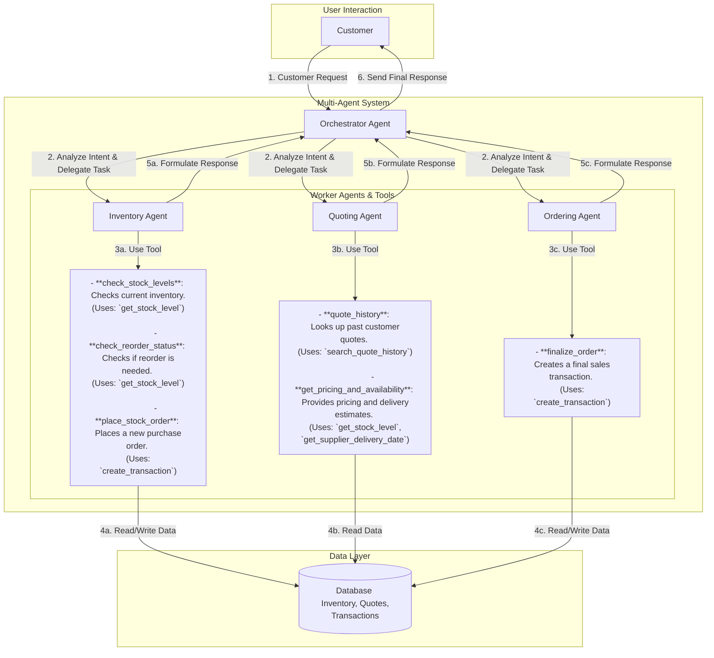

```mermaid
graph TD
    subgraph "User Interaction"
        User[Customer]
    end

    subgraph "Multi-Agent System"
        Orchestrator[Orchestrator Agent]

        subgraph "Worker Agents & Tools"
            InventoryAgent[Inventory Agent]
            QuotingAgent[Quoting Agent]
            OrderingAgent[Ordering Agent]

            InventoryTools["
                - **check_stock_levels**: <br/> Checks current inventory. <br/> (Uses: `get_stock_level`) <br/>
                - **check_reorder_status**: <br/> Checks if reorder is needed. <br/> (Uses: `get_stock_level`) <br/>
                - **place_stock_order**: <br/> Places a new purchase order. <br/> (Uses: `create_transaction`)
            "]
            QuotingTools["
                - **quote_history**: <br/> Looks up past customer quotes. <br/> (Uses: `search_quote_history`) <br/>
                - **get_pricing_and_availability**: <br/> Provides pricing and delivery estimates. <br/> (Uses: `get_stock_level`, `get_supplier_delivery_date`)
            "]
            OrderingTools["
                - **finalize_order**: <br/> Creates a final sales transaction. <br/> (Uses: `create_transaction`)
            "]
        end
    end

    subgraph "Data Layer"
        Database[(Database <br/> Inventory, Quotes, Transactions)]
    end

    %% Main Flow
    User -- "1. Customer Request" --> Orchestrator
    Orchestrator -- "2. Analyze Intent & Delegate Task" --> InventoryAgent
    Orchestrator -- "2. Analyze Intent & Delegate Task" --> QuotingAgent
    Orchestrator -- "2. Analyze Intent & Delegate Task" --> OrderingAgent

    %% Inventory Flow
    InventoryAgent -- "3a. Use Tool" --> InventoryTools
    InventoryTools -- "4a. Read/Write Data" --> Database

    %% Quoting Flow
    QuotingAgent -- "3b. Use Tool" --> QuotingTools
    QuotingTools -- "4b. Read Data" --> Database

    %% Ordering Flow
    OrderingAgent -- "3c. Use Tool" --> OrderingTools
    OrderingTools -- "4c. Read/Write Data" --> Database

    %% Response Flow
    InventoryAgent -- "5a. Formulate Response" --> Orchestrator
    QuotingAgent -- "5b. Formulate Response" --> Orchestrator
    OrderingAgent -- "5c. Formulate Response" --> Orchestrator
    Orchestrator -- "6. Send Final Response" --> User


```

