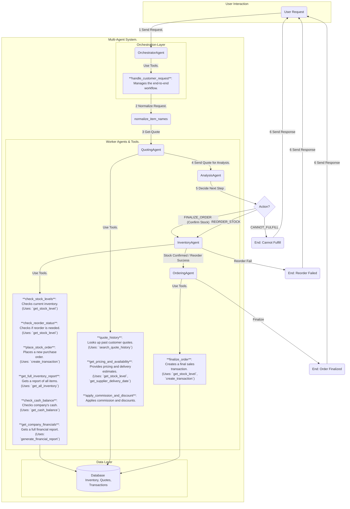

```mermaid
graph TD
    subgraph "User Interaction"
        UserRequest("User Request")
    end

    subgraph "Multi-Agent System."
        subgraph "Orchestration-Layer"
            Orchestrator("OrchestratorAgent")
            OrchestratorTools["
                **handle_customer_request**: <br/> Manages the end-to-end workflow.<br/>
            "]
        end
        
        Normalize["
                **normalize_item_names**: <br/> Standardizes item names in the request.
            "]

        subgraph "Worker Agents & Tools."
            Inventory("InventoryAgent")
            Quoting("QuotingAgent")
            Ordering("OrderingAgent")
            Analysis("AnalysisAgent")

            InventoryTools["
                **check_stock_levels**: <br/> Checks current inventory. <br/> (Uses: `get_stock_level`) <br/>
                **check_reorder_status**: <br/> Checks if reorder is needed. <br/> (Uses: `get_stock_level`) <br/>
                **place_stock_order**: <br/> Places a new purchase order. <br/> (Uses: `create_transaction`) <br/>
                **get_full_inventory_report**: <br/> Gets a report of all items. <br/> (Uses: `get_all_inventory`) <br/>
                **check_cash_balance**: <br/> Checks company's cash. <br/> (Uses: `get_cash_balance`) <br/>
                **get_company_financials**: <br/> Gets a full financial report. <br/> (Uses: `generate_financial_report`)
            "]
            QuotingTools["
                **quote_history**: <br/> Looks up past customer quotes. <br/> (Uses: `search_quote_history`) <br/>
                **get_pricing_and_availability**: <br/> Provides pricing and delivery estimates. <br/> (Uses: `get_stock_level`, `get_supplier_delivery_date`) <br/>
                **apply_commission_and_discount**: <br/> Applies commission and discounts.
            "]
            OrderingTools["
                **finalize_order**: <br/> Creates a final sales transaction. <br/> (Uses: `get_stock_level`, `create_transaction`)
            "]
        end

        subgraph "Data Layer"
        DBFuncs[(Database <br/> Inventory, Quotes, Transactions)]
    end
    end

    %% --- Relationships ---
    Orchestrator -- "Use Tools." --> OrchestratorTools
    Inventory -- "Use Tools." --> InventoryTools
    Quoting -- "Use Tools." --> QuotingTools
    Ordering -- "Use Tools." --> OrderingTools
    InventoryTools --> DBFuncs
    QuotingTools --> DBFuncs
    OrderingTools --> DBFuncs

    %% --- Workflow ---
    UserRequest -- "1 Send Request." --> Orchestrator
    OrchestratorTools -- "2 Normalize Request." --> Normalize(normalize_item_names)
    Normalize -- "3 Get-Quote" --> Quoting
    Quoting -- "4 Send Quote for Analysis." --> Analysis
    Analysis -- "5 Decide Next Step ." --> Decision{Action?}
    Decision -- "FINALIZE_ORDER (Confirm Stock)" --> Inventory
    Decision -- "REORDER_STOCK" --> Inventory
    Decision -- "CANNOT_FULFILL" --> CannotFulfill("End: Cannot Fulfill")
    Inventory -- "Stock Confirmed / Reorder Success" --> Ordering
    Inventory -- "Reorder Fail" --> ReorderFail("End: Reorder Failed")
    Ordering -- "Finalize" --> FinalResponse("End: Order Finalized")
    FinalResponse("End: Order Finalized") -- "6 Send Response" --> UserRequest
    CannotFulfill("End: Cannot Fulfill") -- "6 Send Response" --> UserRequest
    ReorderFail("End: Reorder Failed") -- "6 Send Response" --> UserRequest
```

